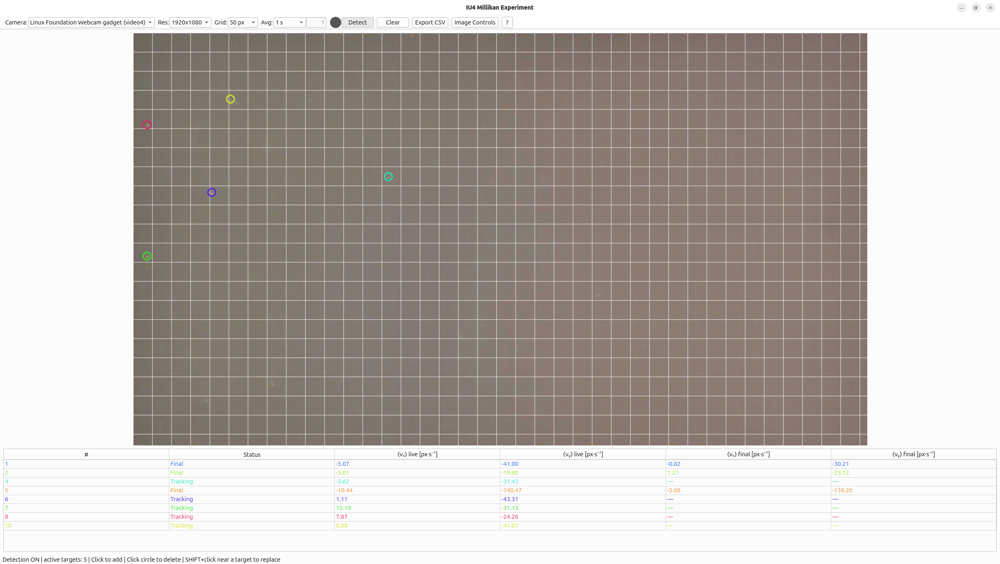

# IU4 Millikan Experiment

Small PyQt/OpenCV application for the **IU4 Millikan oil-drop experiment** at AP Uni Basel. It shows a live camera image, lets the user select one or several oil droplets, tracks them automatically, computes their velocities in px/s, records MP4 videos, and exports the final mean velocities to CSV.

Manual context: [AP Uni Basel IU4 manual](https://ap.physik.unibas.ch/PDF/Manuals/English/IU4en.pdf)



## Camera compatibility

The program should work with **any USB camera** that is visible to Linux as a video device, for example `/dev/video0`, `/dev/video2`, etc. It is not specific to the camera shown in the screenshot. Internally it uses OpenCV `VideoCapture` and tries to list external cameras through `/dev/v4l/by-id` or `v4l2-ctl`.

## Installation: quick local run

On a Linux machine with Python 3:

```bash
sudo apt update
sudo apt install python3-venv v4l-utils
```

Create a virtual environment and install the Python packages:

```bash
cd iu4-millikan
python3 -m venv .venv
source .venv/bin/activate
pip install --upgrade pip
pip install opencv-python PyQt6 numpy
```

Run the application:

```bash
python iu4millikan.py
```

If the camera is not detected, unplug/replug it and check:

```bash
v4l2-ctl --list-devices
```

If Linux denies access to the camera, add your user to the `video` group, then log out and log in again:

```bash
sudo usermod -aG video $USER
```

## Optional lab installation in `/opt`

Use this on the lab computer if the application should be available system-wide and launched from the desktop menu.

```bash
sudo mkdir -p /opt/iu4-millikan
sudo cp iu4millikan.py README.md run.sh icon.png Screenshot-IU4.png /opt/iu4-millikan/
sudo chown -R root:root /opt/iu4-millikan
sudo chmod -R 755 /opt/iu4-millikan
sudo chmod +x /opt/iu4-millikan/run.sh
```

Create the virtual environment:

```bash
sudo apt update
sudo apt install python3-venv v4l-utils
sudo python3 -m venv /opt/iu4-millikan/venv
sudo /opt/iu4-millikan/venv/bin/pip install --upgrade pip
sudo /opt/iu4-millikan/venv/bin/pip install opencv-python PyQt6 numpy
```

Create the desktop launcher:

```bash
sudo tee /usr/share/applications/iu4-millikan.desktop > /dev/null <<'EOF_DESKTOP'
[Desktop Entry]
Name=IU4 Millikan Experiment
Comment=Oil Drop Experiment Application
Exec=/opt/iu4-millikan/run.sh
Icon=/opt/iu4-millikan/icon.png
Terminal=false
Type=Application
Categories=Education;
EOF_DESKTOP

sudo update-desktop-database
```

Launch from the application menu, or run:

```bash
/opt/iu4-millikan/run.sh
```

## How to use

1. Select the USB camera and the resolution.
2. Adjust brightness, contrast, or gamma only if the droplets are difficult to see.
3. Click **Detect**.
4. Click on an oil drop to track it. Several drops can be tracked at the same time.
5. Click on a colored circle to delete that target.
6. Use **Export CSV** to save the final mean velocities.
7. Use the red record button to save a video of the experiment.

## How the oil drops are detected and tracked

The user gives the initial position by clicking on a visible drop. After that, the program tracks the drop locally:

1. Around the previous position $(x_{k-1}, y_{k-1})$, it takes a square region of interest.
2. The region is converted to grayscale and blurred to estimate the local background.
3. A high-pass image is built to make both bright and dark droplets visible:

   $$
   H(x,y) = |I(x,y) - G(x,y)|,
   $$

   where $I$ is the grayscale image and $G$ is its blurred background.

4. Otsu thresholding converts this image into a binary mask:

   $$
   M(x,y) =
   \begin{cases}
   1, & H(x,y) > T_\mathrm{Otsu}, \\
   0, & \text{otherwise}.
   \end{cases}
   $$

5. Small noise blobs and very large reflections are rejected using an area filter.
6. For each remaining blob, the center is computed from image moments:

   $$
   x_c = \frac{M_{10}}{M_{00}}, \qquad
   y_c = \frac{M_{01}}{M_{00}}.
   $$

7. The accepted blob closest to the previous position is chosen. If the jump is too large, the detection is rejected.
8. The new position is smoothed to reduce camera noise:

   $$
   \mathbf r_k = \alpha\,\mathbf r_{k-1} + (1-\alpha)\,\mathbf r_{\mathrm{det}},
   $$

   with $\alpha = 0.65$ in the current code.

Tracking stops automatically when the drop is lost for several frames or when it reaches the image border.

## Velocity, mean velocity, and error estimate

For each frame, the program compares the new position with the previous one:

$$
\Delta x_k = x_k - x_{k-1}, \qquad
\Delta y_k = y_k - y_{k-1}, \qquad
\Delta t_k = t_k - t_{k-1}.
$$

The instantaneous velocities are then

$$
v_{x,k} = \frac{\Delta x_k}{\Delta t_k}, \qquad
v_{y,k} = \frac{\Delta y_k}{\Delta t_k}.
$$

The unit is **px/s**. The sign is corrected if the camera image is rotated by 180°.

The live mean velocity shown in the table is the average over the selected time window:

$$
\langle v_x \rangle_\mathrm{live} = \frac{1}{n}\sum_{k=1}^{n} v_{x,k}, \qquad
\langle v_y \rangle_\mathrm{live} = \frac{1}{n}\sum_{k=1}^{n} v_{y,k}.
$$

When the drop leaves the frame or is lost, the final mean velocity is computed from all stored velocity samples:

$$
\bar v_x = \frac{1}{N}\sum_{k=1}^{N} v_{x,k}, \qquad
\bar v_y = \frac{1}{N}\sum_{k=1}^{N} v_{y,k}.
$$

For the uncertainty of a mean velocity, use the standard error of the mean:

$$
s_v = \sqrt{\frac{1}{N-1}\sum_{k=1}^{N}\left(v_k - \bar v\right)^2},
\qquad
\sigma_{\bar v} = \frac{s_v}{\sqrt{N}}.
$$

This error estimates how much the mean velocity fluctuates because of frame-to-frame tracking noise. In the current version, the GUI displays and exports the final mean velocities; if an error column is needed for the report, compute it from the stored velocity samples using the formula above or add it to the exporter.

All positions are measured in pixels. To convert to physical units, a calibration factor is required:

$$
v_\mathrm{phys} = v_\mathrm{px/s}\,c,
$$

where $c$ is the physical length per pixel.

## Data saving and export

### CSV export

Click **Export CSV** to save the final mean velocities. The default folder is

```text
~/Documents/IU4MillkanExp/
```

The exported file contains one line per tracked drop:

```csv
id,mean vx [px/s],mean vy [px/s]
1,-5.07,-41.00
2,-5.81,-19.98
```

If a drop is still being tracked and has no final value yet, the corresponding CSV entries are left empty.

### Video recording

Click the red record button to start or stop recording. Videos are saved as MP4 files in

```text
~/Documents/IU4MillkanExp/
```

The recorded video includes the grid and the tracked targets. Live or final velocity values are written on the video overlay when available.

